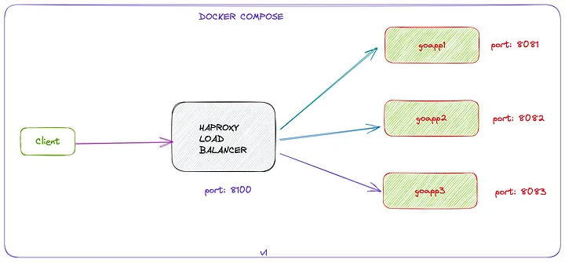

# Load Banlancing 
One of important tools that improve availability is load balancer.A load balancer acts as the “traffic cop” sitting in front of your servers and routing client requests across all servers capable of fulfilling those requests in a manner that maximizes speed and capacity utilization.

# HAProxy
The Reliable, High Performance TCP/HTTP Load Balancer. It is open source and used by many companies who maintain their On-Prem Elastic Load Balancers (ELB).

# Architecture 

# implementation steps
- Create dummy api that just return port that api running on it.
- Create docker file for the project with out exposing any port.
- Create composer file with service nodeapp generated from second step.
- Change environment ASPNETCORE_HTTP_PORTS (default : 8080).
- Add haproxy config file.

# resouces 
https://www.youtube.com/watch?v=9sAg7RooEDc&ab_channel=HusseinNasser

https://medium.com/@SabujJanaCodes/hands-on-haproxy-loadbalancing-with-go-and-docker-compose-part-1-71ce6551f601

